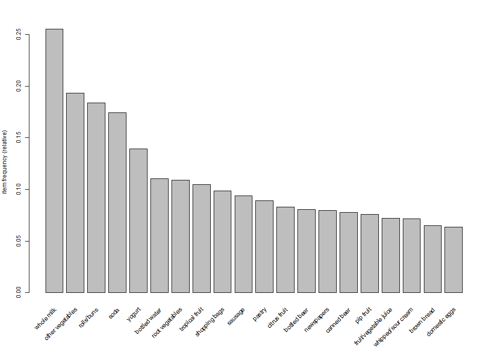

Developing Data Products Project
========================================================
author: Igor Tomashevskiy
date: 12/23/2015

Introduction
========================================================

Market Basket Analysis is used for the recomendations systems by many retailers.  
The association rules provide combinations of items that are often purchased together as a set. 
In marketing, a common transaction unit is the "market basket", the set of thing that are purchased or considered for purchase at one time.
For this project we will examine a small data set  ("grocery")that is included with the "arules" R package.

A simple application named **Grocery Store Transaction Data: Market Baskets** has been developed using **Shiny** R package and deployed at Rstudio's shiny server.

Application Data
========================================================
 - Transactional grocery data utilizes a data structure called a sparse matrix
  - The matrix ("Groceries") has 9835 rows and 169 columns(features for each of the 169 items that might appear in someone's basket).
 
 ```r
 library(arules)
 data("Groceries")
 inspect(head(Groceries,2))
 ```
 
 ```
   items                
 1 {citrus fruit,       
    semi-finished bread,
    margarine,          
    ready soups}        
 2 {tropical fruit,     
    yogurt,             
    coffee}             
 ```
 Shiny App
========================================================
 - The application allows the user to produce a bar plot depicting the proportions of transactions containing certain items.
 - The user can limit the plot to a specific number of items using the slidebar widget.
 - The plot is sorted by decreasing support. The support for a set of items is the proprtion of all transaction that contain the set. If {yogurt, soda} appears in 100 out of 1000 transactions, then support ({yogurt,soda}) =0.1
 - Reactive output displayed as a result of server calculations.
 
Item Frequency Plot
========================================================
 
